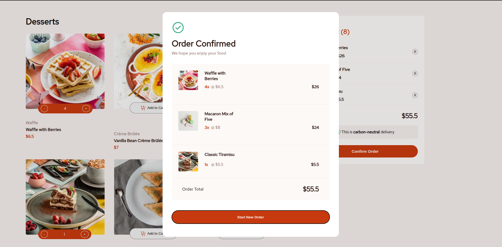

# Frontend Mentor - Product list with cart solution

This is a solution to the [Product list with cart challenge on Frontend Mentor](https://www.frontendmentor.io/challenges/product-list-with-cart-5MmqLVAp_d). Frontend Mentor challenges help you improve your coding skills by building realistic projects.

## Table of contents

- [Overview](#overview)
  - [The challenge](#the-challenge)
  - [Screenshot](#screenshot)
  - [Links](#links)
- [My process](#my-process)
  - [Built with](#built-with)
  - [What I learned](#what-i-learned)
  - [Continued development](#continued-development)
  - [Useful resources](#useful-resources)

**Note: Delete this note and update the table of contents based on what sections you keep.**

## Overview

### The challenge

Users should be able to:

- Add items to the cart and remove them
- Increase/decrease the number of items in the cart
- See an order confirmation modal when they click "Confirm Order"
- Reset their selections when they click "Start New Order"
- See hover states for all interactive elements on the page

### Screenshot




### Links

- Live Site URL: [Link](https://azanra.github.io/list-with-cart/)

## My process

### Built with

- Factory
- Private variable and closures
- IIFE Module

### What I learned

Use this section to recap over some of your major learnings while working through this project. Writing these out and providing code samples of areas you want to highlight is a great way to reinforce your own knowledge.

To see how you can add code snippets, see below:

```html
<h1>Some HTML code I'm proud of</h1>
```

```css
.proud-of-this-css {
  color: papayawhip;
}
```

```js
const proudOfThisFunc = () => {
  console.log("🎉");
};
```

If you want more help with writing markdown, we'd recommend checking out [The Markdown Guide](https://www.markdownguide.org/) to learn more.

Focusing on how to organizing the code. I try multiple ways here, first is wrapping them in a object and put the method as property. The downside of this is that they lost the context of this instance when we are trying
to use the method on the same object, hence we need to bind it if we want to use that method. Note that when we wrap in an object we can't use this in anonymous function because they dont bind this. that's why i use
regular function call on method that need to call another method on the same object.

```js
export const foodController = {
  addToCartEvent: (element) => {
    let foodId = util.getParentId(element);
    util.deleteElement(`#add-${foodId}`);
    unhideAction(foodId);
    enableAction(foodId);
    document.querySelector(`#action-${foodId}`).style.backgroundColor =
      "#c73a0f";
  },
  addCartController: function () {
    this.putListener(".toCartBtn", this.addToCartEvent.bind(this));
  },
};
```

Second is using factory pattern. The difference with the normal constructor is that we don't need to use new keyword to initiate it, we need to call it like how we use a regular function. and we use closure to return the
object. closures is how they can access their surrounding environment like variable or function, even thought the function is already been executed. if they aren't defined in their own scope, they will look up to their parent
scope. There are some property or that i didn't return to the object, because i want them to be able to be accessed only through the getter or setter, preventing it being changed accidentally.

```js
export default function foodFactory(id, image, name, category, price) {
  let amount = 0;
  const countTotalPrice = function () {
    return this.price * amount;
  };
  const incrementAmount = function () {
    amount++;
  };
  const decrementAmount = function () {
    amount > 0 ? amount-- : alert("Item cant be negative");
  };
  const resetAmount = function () {
    amount = 0;
  };
  const getAmount = function () {
    return amount;
  };
  return {
    id,
    image,
    name,
    category,
    price,
    countTotalPrice,
    incrementAmount,
    decrementAmount,
    resetAmount,
    getAmount,
  };
}
```

When we are returning the object in factory, when we want to create a new object with the same name and value in the context of the object that is called object shorthand notation.

```js
let firstName = "hello";
let lastName = "world!";

let object = { firstName: firstName, lastName: lastName };
```

the same as

```js
let object = { firstName, lastName };
```

the last one is IIFE (immediately invoked function expression) is when we want to group a function into single one, also we can use it if we want only to have a single instance of
something

```js
export const orderController = (function () {
  const startOrder = document.querySelector("#start-order");
  const modalOrder = document.querySelector(".modal-order-container");
  const orderListener = (listFood) => {
    startOrder.addEventListener("click", () => {
      modalOrder.close();
      listFood.resetAllAmount();
      resetView();
      foodCard(listFood.getListFood());
      foodController.addCartController();
      foodController.actionController(listFood);
    });
  };
  const resetView = () => {
    util.deleteElement("#contentContainer");
    util.deleteElement(".sidebarOrder");
    util.setTextContent(".order-amount", "");
    util.deleteElement(".cartModalContainer");
    util.setTextContent(".cart-amount", 0);
  };
  return { orderListener };
})();
```

### Continued development

I should decide which pattern to use to organize the code, and use it for the whole project, instead of using multiple pattern like i'm currently doing. The code is still messy and hard to understand especially the one with long
argument. most of the code is still tightly coupled and dependant ot each other. i want to get more practice on using private method or variable, factory and module pattern to organize the code.

### Useful resources

- [This keyword on arrow function](https://syntackle.com/blog/this-keyword-in-arrow-functions-javascript/#:~:text=It%20will%20log%20undefined%20but,object%20user%20like%20this%20user.) - Explain why this is undefined on anonymous function
